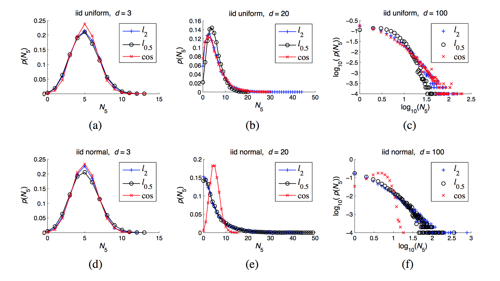
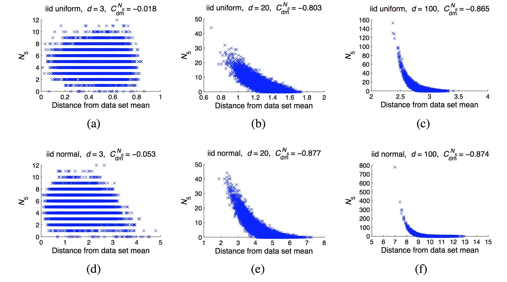
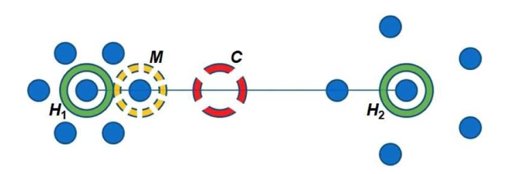

需要考虑的点：

>- 关于 hubness 自适应的问题
>  - 是否可用谱分析替代 PCA（通过谱分析，找相邻特征值 gap 较大的地方——这个方法我只了解个大概，而且我觉得“较大”这样的词也让它变得不能自动化了。）
>- 观测迭代过程中轮廓系数是否逐渐稳定

# 大_面向高维数据的PCA-Hubness聚类方法

郎江涛

（重庆大学计算机学院，重庆，400044）

# 摘要

​	机器学习（Machine Learning）是一门人工智能的科学，该领域的主要研究对象是人工智能，特别是如何在经验学习中改善具体算法的性能。是通过机器自主学习的方式处理人工智能中的问题。近几十年机器学习在概率论、计算复杂性理论、统计学、逼近论等领域均有发展，已形成一门多领域交叉学科 。机器学习通过设计和分析让机器可以自主“学习”的算法以便从海量数据中自动分析 有价值的模式或规律，从而对未知数据进行预测。机器学习可以大致分为下面四种类别：监督学习（Supervised Learning）、无监督学习（Unsupervised Learning）、半监督学习（Semi-supervised Learning）以及增强学习（Reinforcement Learning）。机器学习已广泛应用于诸多领域：数据挖掘、计算机视觉、搜索引擎、自然语言处理、语音和手写识别、生物特征识别、DNA序列测序、医学诊断、检测信用卡欺诈和证券市场分析等。

​	聚类分析（Cluster Analysis，亦称为群集分析）是把相似的对象通过静态分类的方法分成不同的簇或子集，使得在同一个簇中的对象都具有某些相似的属性。传统的聚类分析计算方法主要有如下五种：划分方法（Partitioning Methods）、层次方法(Hierarchical Methods)、基于密度的方法(Density-Based Methods)、基于网格的方法(Grid-Based Methods)和基于模型的方法(Model-Based Methods)。传统的聚类分析适用于低维数据的聚类问题。然而由于现实世界中数据的复杂性，在使用传统聚类算法处理诸多问题和任务时其表现效果不佳，尤其是对于高维数据和大型或海量数据而言。这是因为在高维数据空间中利用传统算法聚类时会碰到下述两个问题：（1）高维数据存在大量冗余、噪声的特征使得不可能在所有维中均存在簇；（2）高维空间中的数据分布十分稀疏，其数据间的距离几乎相等。显然，基于距离的传统聚类方法无法在高维空间中基于距离来构建簇。这便是机器学习中令人头疼的维数灾难（Curse of Dimensionality）问题[d1]。近年来，“维数灾难”已成为机器学习的一个重要研究方向。与此同时，“维数灾难”通常是用来作为不要处理高维数据的无力借口。随着科技的发展使得数据获取变得愈加容易，而数据规模愈发庞大、复杂性越来越高，如海量Web 文档、基因序列等，其维数从数百到数千不等，甚至更高。高维数据分析虽然十分具有挑战性，但是它在信息安全、金融、市场分析、反恐等领域均有很广泛的应用。

​	为了解决维数灾难的问题，本文引入了 hubness 这一全新的概念。并在原有的基于 hub 的聚类算法进行实验分析后，对基于 hub 的算法进行了改进。Hubness 是在2010 年由 Milosˇ Radovanovic ́ 等人提出的一种全新的概念。在数据集中一个点出现在其它点的 k 近邻列表中的次数称为 k-occurrences，而 hubness 会影响k-occurrences 的分布。随着维度的增加，k-occurrences 的分布会逐渐倾斜，这将会导致 hubs 的出现。Hubs 是指那些具有非常高的 k-occurrences 的点，换言之，hubs 的点易于频繁地出现在其它点的 k 近邻类表中。通过探究这种现象的根源，发现这是高维向量空间数据分布的一种内在属性。同时，对基于距离度量的各种机器学习方法进行了直接或非直接的研究，包括监督学习方法，半监督学习方法和无监督学习方法。针对聚类分析，现有的基于hub的算法有以下4种：deterministic, probabilistic, hybrid 和 kernel。这4种方法均为 k-means 算法的扩展。在 deterministic 方法中，首先确定簇的数量然后使用 k-means 算法进行聚类，在每次聚类的过程中将当前簇中的具有高的 hubness 分数的点作为其中心。Probabilistic 方法使用模拟退火算法以一定概率$\theta(=min(1, t/N Prob))$ 选择高 hubness 分数的点作为当前簇的中心。Deterministic 和 probabilistic 方法只依赖于距离矩阵而不必关心数据的表现形式。为了尽可能地获取数据的中心位置则需要使用 hybrid 方法。在 hybrid 方法中，使用数据点的 hubness 分数来指导搜索，但最终会形成基于质心的簇结构。kernel 方法在前三者基础上可以对非超球面簇集进行处理。基于 hub 的聚类算法用于高维数据，由此可见随着维度的增加聚类时间和迭代次数也随之增加。

​	针对基于 hub 的聚类分析方法的优缺点、适用性等问题，本文提出了一种基于 PCA-Hubness 的聚类分析方法。首先，构建 KNN 邻域矩阵，计算每个点的 k-occurrences 值。然后，用PCA 进行降维，在降维的过程中通过偏度的变化率来控制降维的程度，以防损失过多重要的有价值信息。最后，在获取降维数据后利用基于 hub 的算法进行聚类分析。实验证明，本文提出的基于 PCA-Hubness 的聚类算法可以在基本保持本征维数不变的情况下对数据降维，对给定数据集的聚类效果与传统的 kmeans 算法和基于 hub 的聚类算法相当或者更优。从而很大程度上解决了传统算法无法在高维数据空间中聚类分析的问题。

**关键字：**聚类；高维数据；本征维度；Hubness；PCA

# Abstract

**Keywords**: Clustering; High-dimensional Data; Intrinsic Dimension; Hubness; PCA

> 内容确定后再翻译	

​		
​	

​			

# 1 绪论

​	本章主要介绍论文的选题背景及其意义，阐述论文的研究方向和研究的主要内容，并对论文的整体结构作简要说明。

## 1.1 研究背景及意义

​	当今科学技术发展越来越迅捷，加之云计算等新兴大数据处理技术在计算机诸多领域持续发展，人们对大型数据表现出前所未有的关注。网络信息的快速传播使得现实世界产生的数据几乎呈现出指数增长的趋势。随着网络数据的持续增加和网络数据的结构的持续复杂，使得数据分析变得愈加困难。当今社会数据的过快产生使得我们身在一个“被信息所淹没，但却渴望从中获取知识”的环境中[1]。对于这些大量、增长速度持续增加且结构异常复杂的数据，传统的数据处理方法已变得不再适用。于是，一种基于大数据的处理方法应运而生。数据挖掘的主要目标是从大量数据中提取出有价值的模式和知识，然后将其转变为人类可理解的结构，以便后续的工作使用【2】。

​	在大型的数据集中，数据挖掘通过机器学习、人工智能、统计学等交叉方法从而发现有价值的模式和知识。数据挖掘的过程是对大型数据进行监督或半监督的分析，从而获得之前未知的有意义的潜在信息，例如数据的聚类（通过聚类分析）、数据的异常信息（通过利群点检测）和数据之间的联系（通过关联规则分析）。数据挖掘的对象的类型并无限制，可以使任意类型的数据，不管是结构化的数据、半结构化的数据，还是异构型的数据【3】。数据挖掘的主要过程如下图 1.1 所示。数据挖掘的过程通常定义以下三大阶段：（1）预处理阶段：在获取到目标数据集后，有必要对多变量数据进行分析，处理那些包含噪声和含有缺失数据的观测量；（2）数据挖掘阶段：数据挖掘过程涉及六种常见的任务，异常检测（异常／变化／偏差检测）、关联规则学习（依赖建模）、聚类、分析、回归以及汇总，这些均是利用数据挖掘技术从原有的数据集中发现未知的有价值的信息；（3）结果验证阶段：通常，数据挖掘是有目的地挖掘未知的有价值的信息，然而这些信息是否符合预期一般可以通过结果验证来实现。数据挖掘的方法包括监督式学习、无监督式学习、半监督学习、增强学习。监督学习是从已知的训练数据集中获得某种函数用于预测未知的数据集。监督学习训练集中的目标是由人为标注的。常见的监督式学习包括分类、估计、预测。无监督学习与监督学习的不用之处在于训练集是没有人为标注的。常见的非监督式学习包括聚类、关联规则分析。半监督学习介于监督学习与无监督学习之间。增强学习是基于环境而行动，从而获得最大化的预期利益。

> 上述信息可做简略阐述

> 画流程图

​	‘’物以类聚，人以群分“，无论是自然科学还是现实世界中均有各种各样的分类问题。在数据挖掘中，聚类分析是研究分类问题的一种数据分析方法。聚类分析是把大量复杂的数据通过聚类器将其分成若干不同的类别或更多的子集，换言之，聚类分析的目的是尽可能地增大簇内部的相似性同时减小簇之间的相似性。聚类分析在诸多领域均有应用，包括机器学习、数据挖掘、模式识别、图像分析以及生物信息等。

## 1.2 国内外研究现状

​	随着科学技术的发展，人们处理大型复杂数据的需求也越来越强烈，数据挖掘在学术界一直备受关注。数据挖掘的相关理论不断完善和发展，而且其商业价值也逐渐显著。聚类分析是数据挖掘的重要组成部分，自然也受到了研究者的高度关注。就聚类分析本身而言，它并不是一个具体的算法，而是处理某一类问题的通用规则。不同的聚类器可以定义不同的簇结构以及搜寻它们的规则。主流的簇概念包括簇内对象之间的小距离、数据空间的密集区域以及间隔或特定的分布。因此，聚类分析可以被表示为多目标优化问题。不同的数据集和结果的预期用途决定了聚类算法的选择和参数的设定（包括诸如要使用的距离函数，密度阈值或预期聚类的数量）。聚类分析本身并不是一个自动化的过程，而是一个不断迭代的知识发现过程或是交互式多目标优化的过程。在这个迭代过程中需要不断修改数据预处理方式以及模型参数直到到达预期的结果。聚类分析是在1932年由两位人类学专家 Driver 和 Kroeber 首次提出的，1938年 Zubin 将其引入到了心理学领域。

​	由于难以对簇的概念作出准备定义导致有诸多的聚类算法产生，这些聚类算法使用了不同的聚类模型，主流的聚类模型包括：（1）连通性模型（Connectivity Models），例如层次聚类基于距离连通性构建模型；（2）中心性模型（Centroid Models），例如 k-means 算法将单个平均向量表示每个簇类；（3）分布模型（Distribution Models），使用统计分布对聚类进行建模，例如由 EM 算法使用的是多变量正态分布；（4）密度模型（Density Models），例如 DBSCAN 和 OPTICS 将簇定义为数据空间中的连接密集区域；（5）子空间模型（Subspace Models），在Biclustering（也称为协同聚类或双模式聚类）中使用集群成员和相关属性建模；（6）组模型（Group Models），一些算法不提供精确模型，仅提供分组信息；（7）==基于图的模型（Graph-Based Models）：团体，即图中的节点的子集，使得子集中的每两个节点通过边连接，可以被认为是聚类的原型形式。 完全连通性需求的松弛（边缘的一小部分可能丢失）被称为准丛集，如在HCS聚类算法中（Graph-based models: a clique, that is, a subset of nodes in a graph such that every two nodes in the subset are connected by an edge can be considered as a prototypical form of cluster. Relaxations of the complete connectivity requirement (a fraction of the edges can be missing) are known as quasi-cliques, as in the HCS clustering algorithm.）==。聚类可以细致地分为：（1）严格划分聚类，每个对象正好属于一个簇；（2）包含离群点的严格划分聚类，对象也可以不属于任何簇，那么它将会被视为离群点；（3）重叠聚类（也称作可替代聚类或多视图聚类），虽然通常是硬聚类，但对象也可能属于多个簇；（4）分层聚类：属于子集群的对象同时也属于父集群；（5）==子空间聚类：尽管在唯一定义的子空间内的重叠聚类，聚类不期望重叠（Subspace clustering: while an overlapping clustering, within a uniquely defined subspace, clusters are not expected to overlap.）==。

​	聚类分析算法是根据它们的聚类模型进行分类的，没有客观的“正确的”聚类算法，正如 Vladimir 已经指出的，“聚类是在旁观者的眼中（Clustering is in the eye of the beholder）”。针对特定的问题，除非有数据理论依据，否则需要通过实验进行选择合适的聚类算法 [4]。 下面仅列出最主流的聚类算法。

(1) 层次聚类算法

​	层次聚类算法也称作基于连通性的聚类算法，其核心思想是若两个对象越接近，那么它们的相关性就越强。这些算法基于对象间的距离将彼此连通从而形成不同的簇。在很大程度上，一个簇可以由该簇内的最大连通距离来表示。不同的距离会形成不同的簇，这可以通过树形结构来表示，这也是层次聚类名称的来源。层次聚类可分为两大类：（1）自底向上（agglomerative）（2）自顶向下（divisive）。自底向上是开始时所有数据点均各自为一个类别，然后每次迭代将距离最近的两个类合并，直到只有一个类为止。自顶向下的思想与自底向上的思想正好完全相反。计算两个类之间的距离共有三种方法：

- Single Linkage（也称作 nearest-neighbor ），是指集合之间的距离为这两个集合中距离最近的两个点之间的距离，这容易导致 “Chaining” 现象的发生。“Chaining”现象是指原本整体相距较远的簇只因其中个别点之间的距离较近而被合并，若依此合并最终会得到比较松散的簇；
- Complete Linkage：与 Single Linkage 的反面极端，是指集合之间的距离为这两个集合中距离最远的两个点之间的距离。负面效果显而易见，原本已经很近的两个簇，只因有不配合的点存在而不能合并。
- Group Average：是指把集合之间的距离为所有点对的距离的平均值。

​	虽然层次聚类的核心思想比较简单，但是计算复杂度却比较高。因为上述的三种方法均需要计算所有点对之间的距离，而且算法也表明每次迭代只能合并两个子类，这是非常耗时的。

（2）基于质心的聚类

​	在基于质心的聚类中，由中心向量表示一个簇，该簇的中心元素不一定是数据集中的元素。当簇的个数为定值 $k$ 时，k-means 聚类方法给出了关于最优化问题的形式定义：搜寻 $k$ 个簇中心，然后将对象划分给与之最近的簇中心所在的簇。k-means 的目的是最小化簇内平方和（WCSS within-cluster sum of squares）。最优化问题本身是一个 NP 难问题，因此常见的方法是找到其近似解。最著名的近似方法是 Lloyd's[d5]，也就是 k-means 算法。然而，k-means 算法智能只能找到局部最优值，而且使用的是随机的初始化值。k-means 的衍生算法作了如下的改进：选择多次运行的最优值，并且将簇中心限定为数据集中的元素（k-medoids）；选择中值作为簇中心（k-medians）；较少的选择随机值作为簇中心（K-means++）；或者可以模糊聚类（Fuzzy c-means）。大多数基于 k-means 算法的最大缺点之一是需要预先指定簇的个数 $k$。此外，由于这些算法均是基于簇中心的，所以更容易形成大小相似的簇，这通常导致簇之间不正确的边界切割。

​	K-means 有以下重要的理论性质。首先，它可以将数据划分为 Voronoi 图结构。其次，在理论上它与最近邻概念接近，因此在机器学习领域大受欢迎。最后，它可以被视为基于模型分类的变形，并且k-means 算法是EM算法的一种变形。

（3）基于分布的聚类

​	与统计学最密切相关的聚类模型是基于分布的模型。对象的分布越相似，它们分配在同一个簇的可能性越大。该方法易于处理类似于人工生成的数据集（从分布中随机取样）。虽然基于分布的聚类方法有着优秀的理论基础，但是它们却容易导致过拟合问题。因此，我们需要对这类模型添加复杂性约束。从理论上而言，选择越复杂的模型越能更好地结束数据，然而选择适当的模型复杂度却是困难的。

​	最常用的方法是高斯混合模型（使用期望最大化算法）。高斯混合模型是以数据服从高斯混合分布为假设的，换言之，数据可以看作是从多个高斯分布随机选择出来的。每个高斯混合模型由 $k$ 个高斯分布组成，每个高斯分布被称作一个"Component"，高斯混合模型的概率密度函数是由这些Component 线性组合而成，其公式如下：

$$p(x) = \sum_{k=1}^Kp(k)p(x|k)$$

$$=\sum_{k=1}^K N(x|\mu_k, \sigma_k)$$

其中 $K$ 为模型的个数，$\pi_k$为第k个高斯的权重，则为第 $k$ 个高斯的概率密度函数，其均值为$\mu_k$，方差为 $\sigma_k$。我们对此概率密度的估计就是要求$\pi_k$、$\mu_k$和$\sigma_k$各个变量。当求出的表达式后，求和式的各项的结果就分别代表样本x属于各个类的概率。高斯混合模型的优点是投影后的样本点将获得每个类的概率，而非一个确切的分类标签。相对于 k-means 算法，高斯混合模型每一次的迭代计算量均较大。由于高斯混合模型的聚类方法来源于 EM 算法，因此可能会产生局部极值，这与出事参数选取密切相关。高斯混合模型不仅可以用于聚类分析，同样也可用于概率密度估计。

（4）基于密度的聚类

​	基于密度的聚类分析算法的主要目是搜寻被低密度区域分割的高密度区域。不同于基于距离的聚类算法（基于距离的聚类算法是以球状簇为前提进行聚类的），基于密度的聚类算法可以发现任意形状的簇，这有利于处理带有噪声点的数据。分布在稀疏区域的对象通常被认为是噪声或边界点。

​	目前，最流行的基于密度的聚类算法是 DBSCAN（Density-Based Spatial Clustering of Application with Noise）[6]。在DBSCAN算法中数据点分为以下三类：

- 核心点。在 $\varepsilon$-邻域内含有超过MinPts数目的点；
- 边界点。在 $\varepsilon$-邻域内点的数量小于MinPts，但是落在核心点的邻域内
- 噪音点。既不是核心点也不是边界点的点

其中，$\varepsilon$ 为邻域半径，MinPts 为指定的数目。DBSCAN 的算法思想十分简单：若一个点 p 的 $\varepsilon$-邻域包含多于 MinPts 个对象，那么创建 p 作为核心对象的新簇；搜寻与核心对象直接密度可达的对象，将其合并；若没有新的点可以更新簇时，算法结束。

​	OPTICS [12]是 DBSCAN 的泛化，它并不需要为范围参数 $\varepsilon$ 选择合适的值，并产生与分层聚类相关的分层效果。Density-Link-Clustering 结合单连通聚类和OPTICS 的思想，完全消除了 $\varepsilon$ 参数，并且通过使用 R树索引增强了聚类性能。DBSCAN 和 OPTICS 的主要缺点是它们是通过某种程度的密度下降来检测簇边界的。 此外，它们无法检测现实生活数据中普遍存在的内在簇结构。而 DBSCAN 的变形方法 EnDBSCAN 可以解决此类问题[8]。Mean-shift[9]  方法基于核密度估计[10]，将每个对象移动到其附近最密集的区域。最终，对象会收敛到密度的局部最大值。由于昂贵的迭代过程和密度估计，Mean-shift 通常比 DBSCAN 的效率要低。

​	近年来，诸多学者投身于提高现有算法性能的研究中[11],[12]，其中包括CLARANS （Ng和Han，1994）[13]，[17]和BIRCH（Zhang等，1996）[14]。随着处理越来越大的数据集的需求日益增长，这导致了通过换取性能以增加所产生簇的语义分析能力的意愿越来越强烈。这引起了 pre-clustering 的发展，以 canopy 聚类最具代表性[15]。它可以处理超大型的数据集，但是所得到的“聚类”仅仅是对数据集的粗略预分割，之后会使用现有的聚类分析方法对这些数据集进行聚类。学者们一直在进行各种各样的聚类算法尝试，比如基于 seed 的聚类方法[16]。

## 1.3 本文研究的主要内容

## 1.4 论文的章节排版

# 2 聚类分析概述

## 2.1 聚类分析的定义

## 2.2 常用的聚类分析算法

## 2.3 聚类分析的评价标准

## 2.4 聚类分析的评估检验

​	聚类结果的评估也被称为聚类验证。两个簇之间的相似性有诸多的检测方法。这些方法可以衡量不同的聚类方法对同一数据集的聚类效果。

### 2.4.1 内部检验

​	内部评估是指聚类结果的评估依赖于聚类的本身数据。当聚类结果表现出高的类内相似性和低的类间相似性时，这些评估方法会给出一个较高的分值。然而，具有高分值的内部评估却并不一定能够进行有效地信息检索[17]。另外，内部评估易于偏向使用相同聚类模型的算法。比如，基于最优化对象间距离的 k-means 算法，同样基于距离的内部评估将可能高估得到的聚类结果。因此，内部评估方法适用于比较两种算法的性能优劣，然而这却不包含有效性结果（valid results）的比较[4]。有效性指标依赖于数据集本身的结构。比如，k-means 算法只能找到凸簇，所以许多评估指标都是以此为假设的。同样，在具有非凸簇的数据集上，既不使用 k-means 算法，也不采用假定凸簇的评估标准。以下是基于内部标准的评估方法：

（1）Davies–Bouldin 指数

​	Davies-Bouldin 指数计算公式如下：

​							$$DB = \frac{1}{n} \sum_{i=1}^n max_{j \neq i}(\frac{\sigma_i + \sigma_j}{d(c_i, c_j)})$$

其中，$n$ 为簇的个数，$c_x$ 是簇 $x$ 的质心，$\sigma_x$ 是簇 $x$ 中所有元素到簇质心 $ c_x$的距离的平均值，$d(c_i, c_j)$ 是簇 $c_i$ 和簇 $c_j$ 之间的距离。因此，具有越低的 Davies–Bouldin 指数值则表明聚类的结果越好。

（2）Dunn 指数

​	Dunn 指数的目标是识别具有高密度且良好分割的簇群。它是最小化簇间距离与最大化簇内距离的比值。Dunn 指数的计算公式如下：

​		$$D = \frac{min_{1 \le  i \le j \le n} d(i, j)}{max_{1 \le k \le n} d'(k)}$$

其中，$d(i, j)$ 表示簇 $i$ 和簇 $j$ 之间的距离，$d'(k)$ 为簇 $k$ 的内距离。簇间距 $d(i, j)$ 可以任意选择一种度量方式，比如，假定两个簇的质心之间的距离为两个簇之间的距离。同样，簇内距 $d'(k)$ 也有多重表示方式，比如，假定簇内的任意点对之间的最大距离为簇的簇内距。因此，具有越高的 Dunn 指数值则表明聚类的结果越好。

（3）轮廓系数

​	轮廓系数是簇内点对之间的平均距离与该簇内的点到其它簇的距离的最大值的比值， 其计算公式如下所示：

​									$$S_i=\frac{(b_i-a_i)}{max(a_i,b_i)}$$

其中，$a_i$ 表示 $i$ 向量到同一簇内其他点不相似程度的平均值，$b_i$ 表示 $i$ 向量到其他簇的平均不相似程度的最小值。可见轮廓系数的值总是介于 [-1,1] ，越趋近于1代表内聚度和分离度都相对较优。将所有点的轮廓系数求平均，就是该聚类结果总的轮廓系数。轮廓系数适用于 k-means 算法，也可用于确定最优的聚类数。

### 2.4.2 外部检验

​	在外部检验中，聚类结果的评估依赖于未进行聚类的数据，例如已知的类标签和外部基准（external benchmark）。这些基准通常是由该方面的专家设置的一组预分类的元素。因此，这些基准集通常被视为是检验的黄金标准。这些检验方法用于比较聚类结果与预定基准类之间的近似程度。 由于类可能包含内部结构、属性不允许分离簇以及类可能包含异常情况等等，这些因素导致研究人员对基准集是否能够对真实数据进行有效检验产生了疑问[18]。

​	这些方法与评估分类问题的方法相似。不同于统计被正确标记的类，这些方法统计的是同一个簇内点对之间相同标签的个数。以下是基于外部标准的评估方法：

（1）纯度

​	纯度用于衡量每个簇中包含单一类的个数[19]，换言之，纯度是用于统计当前簇中最常见的类的点的个数。将所有簇的纯度累加并除以数据集的样本数就是该数据集的纯度。纯度的计算公式如下：

​				$$\frac{1}N \sum_{m \in M} max_{d \in D}|m \cup d|$$

其中，M 为簇集，D 为类标签集，N 为数据集的样本数。

（2）Rand 指数

​	Rand 用于衡量聚类簇与基准分类信息的相似度[20]，也可视为该算法所作出的正确决策的百分比，其计算公式突下：

​			$$RI = \frac{TP + TN}{TP+TN+FP+FN}$$

其中，TP 为同一个类的点被分到同一个簇的数量，TN 为不同类的点被分到不同簇的数量，FP 为不同类的点被分到同一个簇的数量，FN 为同一类的点被分到不同簇的数量。Rand 指数存在的一个问题是FP 和 FN 具有相同的权重。这对于某些聚类算法而言可能是不期望的特性，下面的 F-measure会解决这个问题。

（3）F-measure

F-measure 通过参数 $\beta$ 来对召回度进行加权从而平衡 FN 的分布[21]，精度和召回度的计算公式如下：

$$P = \frac{TP}{TP+FP}$$

$$R = \frac{TP}{TP+FN}$$

其中 $P$ 是精度，$R$ 是召回度。结合精度和召回度，F-measure 的计算公式如下：

$$F_{\beta} = \frac{(\beta^2 +1 ) \cdot P \cdot R}{\beta^2 \cdot P+R}$$

其中，$\beta = 0$ 时，$F_0 = P$。换言之，当 $\beta = 0$ 时，召回度对 F-measure 无影响。随着 $\beta$  的增加，召回度在 F-measure 的权重也在增加。

# 3 hub 

> a thorough discussion of the necessary conditions for hubness to occur in high dimensions will be given in Section 5.2.

> 维数灾难（Curse of Dimensionality），这一术语最初是由 Bellman 在1961年考虑优化问题时引入的，如今主要是指由数据空间中的高维数据向诸多领域所引发的挑战。在机器学习领域，受影响的方法和任务包括贝叶斯建模（Bishop，2006）、最近邻预测（Hastie et al。，2009）及搜索（Korn et al。，2001） 等。维数灾难造成的影响之一是距离集中（Distance Concentration），这是说在高维数据中的点对之间的距离渐渐趋向于相同。Hinneburg 和 Aggarwal 等人已经对高维数据中的距离集中和无意义的最近邻作了深入的研究。维数灾难造成的另一方面影响是 hubness。令 $D \subset R^d$，$D$ 为 $R^d$ 空间中的数据集，$N_k(x)$ 是数据集 $D$ 中的点 $x$ 的 $k-occurrences$ 值，$k-occurrences$  是指点 $x$ 出现在其它点的 $k$ 近邻列表中的次数。随着数据集维数的增加，$N_k$ 的分布开始逐渐向右倾斜，这导致了 $hubs$ 的出现， $hubs$ 是指那些极易出现在其它点的 $k$ 近邻列表中的点。不同于距离集中，hubness 及其影响在机器学习中并未引起太多的关注。~~The effect of the phenomenon on machine learning was demon- strated, for example, in studies of the behavior of kernels in the context of support vector machines, lazy learning, and radial basis function networks (Evangelista et al., 2006; Franc ̧ois, 2007).（例如，在支持向量机，惰性学习和径向基函数网络（Evangelista et al。，2006; François，2007）上下文中内核行为的研究中证明了这种现象对机器学习的影响。 ）~~

## Hubness 现象

令 $D ⊂ R^d，d\in\{1,2,…\}$ 表示一组数据点，其中 $x_1,x_2,…x_n$ 为数据集 $D$ 的元素。令 $dist$ 表示在 $R^d$ 空间中的一个距离函数 $p_{i,k}$，其中 $i, k \in \{1,2,…,n\}$ 如下定义：

​						$$p_{i,k}=\begin{cases} 1, & \text{if $x$ is among k nearest neighbours of $x_i$, according to $dist$} \\0  & \text{otherwise} \end{cases}$$

​	在此基础之上，定义 $N_k(x)=\sum_{i=1}^np_{i,k}(x)$，$N_k(x)$ 表示为在 $R^d$ 空间中，$x$ 出现在其它 k-nearest neighbor 列表中的次数，也记为 K-occurrence，仅根据数据点的 K-occurrence 的大小无法确定 hubness 对实验结果有何种影响。 数据点的 bad k-occurrences 表示为 $B_{N_K (x)}$，是指数据点 x 作为数据集 D 中其它的点的 k-nearest neighbor次数，并且 x 点的标签和那些点的标签不匹配。数据点的 good k-occurrences 表示为 $G_{N_K(x)}$， 是指点 x 的标签与那些点的标签相匹配[5]。为了表征 $N_k$ 的非对称性，我们使用 k-occurrences 分布的标准第三矩（也称作偏度）[b1]，

​									$$S_{N_k}=\frac{E(N_k-\mu_{N_k})^3}{\sigma_{N_k}^3}$$

其中 $\mu_{N_k}$ 和 $\sigma_{N_k}$ 分别是 $N_k$ 的均值和标准差。偏度是用于衡量实数域中随机变量分布的不对称性。偏度的值有正负之分，偏度为负则表明绝大多数的值（包括中值在内）位于平均值的右侧；偏度为正则表明绝大多数的值（不一定包括中值）位于平均值的左侧；偏度为零则表明数值近似地均匀分布在均值的两侧，却不一定为对称分布。

​	斯皮尔曼等级相关系数（Spearman correlation），用于评估两个变量相关性的非参数指标，记作 $\rho$。对于样本数为 $n$ 的数据集 $\mathbf X, \mathbf Y$，$x_i, y_i$ 为其对应的等级数据，相关系数$\rho$ 为：

$$\rho = \frac{\sum_i(x_i - \bar{x})(y_i - \bar{y})}{\sqrt{\sum_i(x_i-\bar{x})^2\sum_i(y_i-\bar{y})^2}}$$

​	在现实应用中，变量之间的连接并没有显著作用，因此可以对 $\rho$ 进行如下简化：

​		$$\rho = 1 - \frac{6 \sum d_i^2}{n(n^2 -1)}$$

其中，$d_i$ 表示被评估的两个变量等级之间的差值，$n$ 为样本数。斯皮尔曼相关系数阐述了 **X** (独立变量) 与 **Y** (依赖变量)的相关性。 若变量 **X** 增加时， 变量 **Y** 也增加，那么斯皮尔曼相关系数的值为正数；若变量 **X** 增加时，变量 **Y** 却在减少，那么斯皮尔曼相关系数的值为负数；若变量 **X** 和变量 **Y** 没有相关性，那么斯皮尔曼相关系数则为零。

## Hubs 的位置

​	以样本数据分布的均值作为参考点，可以看到 *k-occurrences* 的值与样本的位置的关系。 在高维空间中，当潜在的数据分布是单峰时，hubs 会接近样本的均值；当潜在的数据分布为多峰时（若干个单峰分布混合而成），hubs 趋向于接近最近的单峰分布的均值。

​	Hubness 现象常常与距离集中现象关联在一起。距离集中现象是指数据集中所有点到某一参考点的距离分布的标准差与均值的比值随着数据集维数不断增加而趋向于 0 的现象。

> Based on existing the- oretical results discussing distance concentration (Beyer et al., 1999; Aggarwal et al., 2001), high- dimensional points are approximately lying on a hypersphere centered at the data-set mean. 

​	基于现有的距离集中理论表明（Beyer et al。，1999; Aggarwal et al。，2001），高维数据分布于以样本均值为中心的的超球面上。

> 由卡方分布延伸出来皮尔森卡方检定常用于： (1)样本某性质的比例分布与总体理论分布的拟合优度；(2)同一总体的两个随机变量是否独立；(3)二或多个总体同一属性的同素性检定。[b2] 补充

节点中心性这一术语通常应用在网络分析领域[d3]，在聚类分析中，点的空间中心性与*k-occurrences* 有关，随着维度的增加，越接近空间中的其它点。

真实数据集与人工数据集有两处不同；（1）真是数据集通常包含相关属性；（2）真是数据集通常是由多个簇组成的。为了检验第一个属性（相关属性），采用了Franc ̧ois的方法[b4]。

> 对每一个数据集，打乱它的每一维的顺序 （确认一下）这样就可以消除它们之间的相关性，数据集的本征维数将会逼近它的嵌入维数（embedding dimensionality）。

在真实数据集中，hubs 相比其它点更易接近它们各自所在的簇中心。

$N_k$ 的偏度与本征维数强烈相关，在本征维数越高的数据空间，hubs 会越接近簇中心。

> First, let us consider the geometric upper limit to the number of points that point x can be a nearest neighbor of, in Euclidean space. In one dimension, this number is 2, in two dimensions it is 5, while in 3 dimensions it equals 11 (Tversky and Hutchinson, 1986). Generally, for Euclidean space of dimensionality d this number is equal to the kissing number, which is the maximal number of hyperspheres that can be placed to touch a given hypersphere without overlapping, with all hyperspheres being of the same size.14 Exact kissing numbers for arbitrary d are generally not known, however there exist bounds which imply that they progress exponentially with d (Odlyzko and Sloane, 1979; Zeger and Gersho, 1994). Furthermore, when considering k nearest neighbors for k > 1, the bounds become even larger. Therefore, only for very low values of d geometrical constraints of vector space prevent hubness. On the other hand, for higher values of d hubness may or may not occur, and the geometric bounds, besides providing “room” for hubness (even for values of k as low as 1) do not contribute much in fully characterizing the hubness phenomenon. Therefore, in high dimensions the behavior of data distributions needed to be studied.

> if the number of dimensions is large relative to the number of points, one may expect to have a large proportion of points with N1 equaling 0, and a small proportion of points with high N1 values, that is, hubs.16 Trivially, Equation 23 also holds for Nk with k > 1, since for any point x, Nk(x) ≥ N1(x).

​	本章我们将会讨论在考虑降维技术的情况下，$N_k$ 的偏度与本征维数的相互关系。此研究的目的主要在于探究降维技术是否能够缓解 $N_k$ 的偏度这一问题。本文采用了主成分分析的降维技术（PCA）。在多变量的统计分析中，主成分分析（Principal components analysis，PCA）常常用于分析和简化数据集。主成分分析通过保留对方差贡献最大的样本特征，从而降低数据集的维数。Pearson 于1901 年发明了主成分分析[b5]，常常用于数据分析以及模型建立。主成分分析的主要思想是将协方差矩阵进行特征分解，从而获得数据的主要成分（特征向量）及其对应的权重（特征值）。

## PCA理论基础

​	本节将会在探讨协方差矩阵的特征向量是 *k* 维理想特征的理论知识：最大方差理论、最小误差理论以及坐标轴相关度理论。

### 最大方差矩阵理论

​	在数字信号处理中，具有较大方差的是信号，反之则是噪声，那么，信噪比就可以被描述为是信号与噪声的方差的比值。因此，理想的 *k* 维特征就是将原始的 *n* 维数据集变换为 *k* 特征后，每一个维度上均具有较大的样本方差。

### 最小平方误差理论

​	令 $D \subset R^d, d \in \{1,2,3,…\}$，数据集 *D* 包含 *n* 个样本点（$x_1, x_2,…,x_n$），样本在分割面上的投影记为 $x_k'$，那么最小平方误差的公式如下：

​						$$\sum_{k=1}^d||(x_k'-x_k)||^2$$

PCA算法步骤：

（1） 使用 *n* 行 *d* 列的矩阵 *X* 表示原始数据；

（2）将矩阵 *X* 的每一列进行零均值化，即减去这一行的均值；

（3）求解协方差矩阵，$C=\frac{1}{n}X^TX$；

（4）求解协方差矩阵的特征值及其特征向量；

（5）令特征向量按照其对应的特征值降序排序，取前 *k* 列组成新的矩阵 *P*；

（6）Y = PX 即为降维后新的数据。

## 聚类

​	基于距离的聚类算法的主要目标是最小化同一个簇内对象之间的距离同时最大化簇间对象之间的距离。在高维数据空间中，*k-occurrences* 的偏度将会对上述两个对象造成影响。一方面，具有低 *k-occurrences* 的点很可能会增加簇内对象之间的距离，这些点远离数据集的其它点，可以将其视为离群点。目前，关于离群点在聚类分析方面的应用已经作了诸多的研究，通常离群点被发现之后会直接将其移除。另一方面，具有高 *k-occurrences* 的点，也就是hubs ，很有可能会接近簇的中心。另外， *hubness* 的度依赖于数据的本征维数而非嵌入维数（embedding dimensionality），本征维数是指表示数据集所有点对之间的距离所需特征的最小数量。通常，*hubness* 与本征维数相关而与距离或相似度的度量方式无关。通常，低 high-hubness 分数表明该点远离数据样本中的其它点，并且很有可能是一个离群点。然而，在高维数据空间中，由于数据本身的分布情况使得 high-hubness 分数的点变得很普遍。这些点将会导致簇内样本之间距离的增加。同样值得注意的是，一些聚类算法因为 *hubs* 的存在而使聚类性能变差。这是因为某些 *hubs* 会接近来自不同簇的点[5]。之前已经提到过，相比其它点而言hubness 分数越高的点越容易接近簇的均值，随之而来变产生一个疑问：hubs 会是质心（medoids）吗？Nenad Toma sev 等人通过实验研究发现[8]：在低维数据空间中，hubs 远离簇的质心甚至远离普通的点。然而，随着维数的增加，==簇的质心到hubs的最小距离会逐渐收敛于簇的质心到mediods的最小距离==。这表明一些medoids就是hubs。然而，簇的质心到hubs的最大距离却没有上述的相关性。同时观测到随着每一次的聚类迭代，簇的质心到hubs 的最大聚类也逐渐减小，这就表明簇的质心越来越接近hubs。因此在高维数据中，hubs可以在很大程度上代表该簇中的元素。

## hub聚类算法

在k-means 迭代过程中，centroids 和 medoids 易趋向于接近 高 hubness 分值的点，而这意味着使用hubs作为prototype可以加快算法的收敛速度。Centroids依赖当前簇中的所有元素，而hubs依赖它们的近邻元素因此携带着很多局部的centrality的信息。Hubness主要可分为全局hubness和局部hubness。局部hubness是全局hubness在给定任一簇情况下的约束。因此，局部hubness的分数是指在同一个簇中的某个点的  *k-occurrences*  的数量。Hub聚类算法的计算复杂度主要是由计算hubness分数的代价决定的。

​		

### 1 Deterministic方法

​	使用hubs进行聚类分析的一种简单方法是将它们作为簇的质心。该算法一般称为K-hubs算法，其算法思想如下：				

Algorithms 1. K-hubs

initializeClusterCenters();

Cluster[] clusters = formClusters(); 	

**repeat**

​	float $\theta$ = getProbFromSchedule(t); 

​	**for all** Cluster c $\in$ clusters **do**		

​			DataPoint h = findClusterHub(c);

​			setClusterCenter(c, h);		

​	**end for**

**until** noReassignments

**return** clusters	

尽管K-hubs聚类算法可以得到很好的聚类效果，但是它对初始中心点十分敏感。为了增加找到全局最优解的概率，将随机变量引入到了*K-hubs*中。

### 2 Probabilistic方法

尽管拥有最高hubness分值的点可以最大可能地代表簇中心，然而也不应该簇中其它点的相关信息。基于广泛使用的模拟退火方法实现了一个平方hubness-proportional的随机方法[d22]。将温度因子引入到 *K-hubs* 算法中，那么它的初始值就是完全随机的，该方法称为 *hubness-*
*proportional clustering* （HPC）聚类算法，其算法思想如下：

Algorithm 2. HPC. 

initializeClusterCenters();

Cluster[] clusters = formClusters(); 

float t = $t_0$; initialize temperature 

**repeat**

​	float $\theta$ = getProbFromSchedule(t); 

​	**for all** Cluster c $\in$ clusters **do**

​		**if** randomFloat(0,1) < $\theta$  **then** 

​			DataPoint h = findClusterHub(c);

​			setClusterCenter(c, h);
​		**else**

​			**for all** DataPoint x $\in$ c **do**

​				setChoosingProbability(x, $N_k^2(x)$); 

​			**end for**

​			normalizeProbabilities();

​			DataPoint h = chooseHubProbabilistically(c); 

​			setClusterCenter(c, h);

​		**end if** 

​	**end for**
​	clusters = formClusters();

​	t = updateTemperature(t); 

**until** noReassignments

**return** clusters	
​	

​	在高维数据空间中，Hubness-proportional 聚类算法可行的原因在于*k-occurrences*分布的偏度。Hubness分值越低的点成为簇中心的可能性越低。HPC 算法采用了一个相当繁琐的温度计方案 *getProbFromSchedule(t)*，概率迭代的次数$N_{Prob}$作为算法的参数，并且概率$\theta = min(1, t/N_{Prob})$。其它的随机方案也是可行的甚至会产生更好的聚类效果。

​			
​		
​	

​		
​		
​		
​	

### 3 Hybird方法

​	K-hubs聚类算法和HPC聚类算法都没有关注数据或对象的表现形式（representation），它们只关注距离矩阵。然而，如果数据的表现形式是已知的，那么便可以利用centroids的相关性质进行聚类。使用点的hubness分数指导聚类搜索，最终会形成一个基于centroid的聚类结构。该算法称为*hubness-proportional K-means* （HPKM）聚类算法，它与 HPC聚类算法的唯一不同之处在于确定阶段使用的是k-means更新数值而非K-hubs。

Algorithm 3. HPKM. 

initializeClusterCenters();

Cluster[] clusters = formClusters(); 

float t = $t_0$; initialize temperature 

**repeat**

​	float $\theta$ = getProbFromSchedule(t); 

​	**for all** Cluster c $\in$ clusters **do**

​		**if** randomFloat(0,1) < $\theta$  **then** 

​			DataPoint h = findClusterCentroid(c);

​			setClusterCenter(c, h);
​		**else**

​			**for all** DataPoint x $\in$ c **do**

​				setChoosingProbability(x, $N_k^2(x)$); 

​			**end for**

​			normalizeProbabilities();

​			DataPoint h = chooseHubProbabilistically(c); 

​			setClusterCenter(c, h);

​		**end if** 

​	**end for**

​	clusters = formClusters();

​	t = updateTemperature(t); 

**until** noReassignments

**return** clusters	
​		

​		
​		
​	​		
​	

​	

[b1] Groeneveld, RA; Meeden, G. Measuring Skewness and Kurtosis. The Statistician. 1984, 33 (4): 391–399. 

[b2] Pearson, Karl. On the criterion that a given system of deviations from the probable in the case of a correlated system of variables is such that it can be reasonably supposed to have arisen from random sampling (PDF). Philosophical Magazine Series 5. 1900, 50 (302): 157–175. 

[b3] John P. Scott. Social Network Analysis: A Handbook. Sage Publications, 2nd edition, 2000.

[b4] Damien Franc ̧ois. High-dimensional Data Analysis: Optimal Metrics and Feature Selection. PhD thesis, Universite ́ catholique de Louvain, Louvain, Belgium, 2007.

[b5] Pearson, K. On Lines and Planes of Closest Fit to Systems of Points in Space (PDF). Philosophical Magazine. 1901, 2 (6): 559–572.

# 4 基于 PCA-Hubness 的聚类方法

# 5 总结与展望

## 5.1 总结

## 5.2 展望

# 致谢 

# 参考文献： 

[d1] John，N.，Megatrends：Ten New Directions Transforming Our Lives. NY：Futura，1984：p. 28.

[d2] Data Mining Curriculum. ACM SIGKDD. 2006-04-30.

[d3] 潘有能，XML 挖掘：聚类、分类与信息提取. 杭州：浙江大学出版社，2012

[d4] Estivill-Castro, Vladimir (20 June 2002). "Why so many clustering algorithms — A Position Paper". ACM SIGKDD Explorations Newsletter. 4 (1): 65–75. 

 [d5] Lloyd, S. (1982). "Least squares quantization in PCM". IEEE Transactions on Information Theory. 28 (2): 129–137.

[d6]  Ester, Martin; Kriegel, Hans-Peter; Sander, Jörg; Xu, Xiaowei (1996). "A density-based algorithm for discovering clusters in large spatial databases with noise". In Simoudis, Evangelos; Han, Jiawei; Fayyad, Usama M. Proceedings of the Second International Conference on Knowledge Discovery and Data Mining (KDD-96). AAAI Press. pp. 226–231.

[d7]  Ankerst, Mihael; Breunig, Markus M.; Kriegel, Hans-Peter; Sander, Jörg (1999). "OPTICS: Ordering Points To Identify the Clustering Structure". ACM SIGMOD international conference on Management of data. ACM Press. pp. 49–60.

[d8] Roy, S.; Bhattacharyya, D. K. (2005). "An Approach to find Embedded Clusters Using Density Based Techniques". LNCS Vol.3816.

[d9] Cheng, Yizong (August 1995). "Mean Shift, Mode Seeking, and Clustering". IEEE Transactions on Pattern Analysis and Machine Intelligence. IEEE. 17 (8): 790–799.

[d10] Xu, X.; Yan, Z.; Xu, S. (2015). "Estimating wind speed probability distribution by diffusion-based kernel density method". Electric Power Systems Research. 121: 28–37.

[d11] Sculley, D. (2010). Web-scale k-means clustering. Proc. 19th WWW.

[d12] ]Huang, Z. (1998). "Extensions to the k-means algorithm for clustering large data sets with categorical values". Data Mining and Knowledge Discovery. 2: 283–304.

[d13] R. Ng and J. Han. "Efficient and effective clustering method for spatial data mining". In: Proceedings of the 20th VLDB Conference, pages 144-155, Santiago, Chile, 1994.

[d14] Tian Zhang, Raghu Ramakrishnan, Miron Livny. "An Efficient Data Clustering Method for Very Large Databases." In: Proc. Int'l Conf. on Management of Data, ACM SIGMOD, pp. 103–114.

[d15]  McCallum, A.; Nigam, K.; and Ungar L.H. (2000) "Efficient Clustering of High Dimensional Data Sets with Application to Reference Matching", Proceedings of the sixth ACM SIGKDD international conference on Knowledge discovery and data mining, 169-178

[d16] Can, F.; Ozkarahan, E. A. (1990). "Concepts and effectiveness of the cover-coefficient-based clustering methodology for text databases". ACM Transactions on Database Systems. 15 (4): 483–517. 

[d17] Manning, Christopher D.; Raghavan, Prabhakar; Schütze, Hinrich. Introduction to Information Retrieval. Cambridge University Press. ISBN 978-0-521-86571-5.

[d18] Färber, Ines; Günnemann, Stephan; Kriegel, Hans-Peter; Kröger, Peer; Müller, Emmanuel; Schubert, Erich; Seidl, Thomas; Zimek, Arthur (2010). "On Using Class-Labels in Evaluation of Clusterings" (PDF). In Fern, Xiaoli Z.; Davidson, Ian; Dy, Jennifer. MultiClust: Discovering, Summarizing, and Using Multiple Clusterings. ACM SIGKDD.

[d19] Manning, Christopher D.; Raghavan, Prabhakar; Schütze, Hinrich. Introduction to Information Retrieval. Cambridge University Press. ISBN 978-0-521-86571-5.

[d20] Rand, W. M. (1971). "Objective criteria for the evaluation of clustering methods". Journal of the American Statistical Association. American Statistical Association. 66 (336): 846–850.

[d21]  Powers, David M W (2011). "Evaluation: From Precision, Recall and F-Measure to ROC, Informedness, Markedness & Correlation" (PDF). Journal of Machine Learning Technologies. 2 (1): 37–63.

[d22] D. Corne, M. Dorigo, and F. Glover, New Ideas in Optimization. McGraw-Hill, 1999.

[d1] Richard Ernest Bellman. Dynamic Programmin. Courier Dover Publications. 2003. 

[1] Houle, M. E.，Kriegel, H. P.，Kröger, P.，Schubert,E.，Zimek.A. Scientific and Statistical Database Management[J]，Lecture Notes in ComputerScience **6187**: 482. 2010.

[2] Tony Jebara，Jun Wang，Shih-Fu Chang. Graphconstruction and b-matching for semi-supervised learning[J]. In Proceedings ofthe 26th International Conference on Machine Learning(ICML)， pages441–448，2009.

[3] Amina M，Syed Farook K. A Novel Approach forClustering High-Dimensional Data using Kernel Hubness[J]. InternationalConfenrence on Advances in Computing and Communication. 2015.

[4] Ester Martin，Kriegel Hans-Peter，Sander,Jörg，Xu, Xiaowei，Simoudis Evangelos，Han,Jiawei，FayyadUsama M., eds. A density-based algorithm for discovering clusters in largespatial databases with noise[J]. Proceedings of the Second InternationalConference on Knowledge Discovery and Data Mining (KDD-96). AAAI Press. pp.226–231. 

[5] Milosˇ Radovanovic ́，Alexandros Nanopoulos，MirjanaIvanovic ́. Hubs in Space: Popular Nearest Neighbors in High-DimensionalData[J]，Journal of Machine Learning Research 11 (2010) 2487-2531. 2010

[6] Abdi. H，Williams L.J. Principal componentanalysis[J]. Wiley Interdisciplinary Reviews: Computational Statistics. 2 (4):433–459. 2010

[7] Peter J. Rousseeuw. Silhouettes: a Graphical Aid tothe Interpretation and Validation of Cluster Analysis[J]. Computational andApplied Mathematics. **20**: 53–65.1987.

[8] Nenad Toma sev，Milo s Radovanovi c，DunjaMladeni c，andMirjana Ivanovi c. The Role of Hubness in Clustering High-Dimensional Data[J]，IEEETRANSACTIONS ON KNOWLEDGE AND DATA ENGINEERING, VOL. 26, NO. 3，2014  

 

#  附录

## 作者在攻读学位期间发表的论文目录：

 

 

 

 

 

 