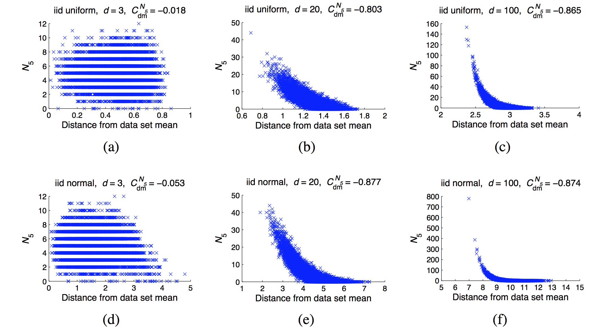

# 相关文章翻译

> a thorough discussion of the necessary conditions for hubness to occur in high dimensions will be given in Section 5.2.

> 维数灾难（Curse of Dimensionality），这一术语最初是由 Bellman 在1961年考虑优化问题时引入的，如今主要是指由数据空间中的高维数据向诸多领域所引发的挑战。在机器学习领域，受影响的方法和任务包括贝叶斯建模（Bishop，2006）、最近邻预测（Hastie et al。，2009）及搜索（Korn et al。，2001） 等。维数灾难造成的影响之一是距离集中（Distance Concentration），这是说在高维数据中的点对之间的距离渐渐趋向于相同。Hinneburg 和 Aggarwal 等人已经对高维数据中的距离集中和无意义的最近邻作了深入的研究。维数灾难造成的另一方面影响是 hubness。令 $D \subset R^d$，$D$ 为 $R^d$ 空间中的数据集，$N_k(x)$ 是数据集 $D$ 中的点 $x$ 的 $k-occurrences$ 值，$k-occurrences$  是指点 $x$ 出现在其它点的 $k$ 近邻列表中的次数。随着数据集维数的增加，$N_k$ 的分布开始逐渐向右倾斜，这导致了 $hubs$ 的出现， $hubs$ 是指那些极易出现在其它点的 $k$ 近邻列表中的点。不同于距离集中，hubness 及其影响在机器学习中并未引起太多的关注。~~The effect of the phenomenon on machine learning was demon- strated, for example, in studies of the behavior of kernels in the context of support vector machines, lazy learning, and radial basis function networks (Evangelista et al., 2006; Franc ̧ois, 2007).（例如，在支持向量机，惰性学习和径向基函数网络（Evangelista et al。，2006; François，2007）上下文中内核行为的研究中证明了这种现象对机器学习的影响。 ）~~

# Hubness 现象

令 $D ⊂ R^d，d\in\{1,2,…\}$ 表示一组数据点，其中 $x_1,x_2,…x_n$ 为数据集 $D$ 的元素。令 $dist$ 表示在 $R^d$ 空间中的一个距离函数 $p_{i,k}$，其中 $i, k \in \{1,2,…,n\}$ 如下定义：

​						$$p_{i,k}=\begin{cases} 1, & \text{if $x$ is among k nearest neighbours of $x_i$, according to $dist$} \\0  & \text{otherwise} \end{cases}$$

​	在此基础之上，定义 $N_k(x)=\sum_{i=1}^np_{i,k}(x)$，$N_k(x)$ 表示为在 $R^d$ 空间中，$x$ 出现在其它 k-nearest neighbor 列表中的次数，也记为 K-occurrence，仅根据数据点的 K-occurrence 的大小无法确定 hubness 对实验结果有何种影响。 数据点的 bad k-occurrences 表示为 $B_{N_K (x)}$，是指数据点 x 作为数据集 D 中其它的点的 k-nearest neighbor次数，并且 x 点的标签和那些点的标签不匹配。数据点的 good k-occurrences 表示为 $G_{N_K(x)}$， 是指点 x 的标签与那些点的标签相匹配[5]。为了表征 $N_k$ 的非对称性，我们使用 k-occurrences 分布的标准第三矩（也称作偏度）[b1]，

​									$$S_{N_k}=\frac{E(N_k-\mu_{N_k})^3}{\sigma_{N_k}^3}$$

其中 $\mu_{N_k}$ 和 $\sigma_{N_k}$ 分别是 $N_k$ 的均值和标准差。偏度是用于衡量实数域中随机变量分布的不对称性。偏度的值有正负之分，偏度为负则表明绝大多数的值（包括中值在内）位于平均值的右侧；偏度为正则表明绝大多数的值（不一定包括中值）位于平均值的左侧；偏度为零则表明数值近似地均匀分布在均值的两侧，却不一定为对称分布。

​	斯皮尔曼等级相关系数（Spearman correlation），用于评估两个变量相关性的非参数指标，记作 $\rho$。对于样本数为 $n$ 的数据集 $\mathbf X, \mathbf Y$，$x_i, y_i$ 为其对应的等级数据，相关系数$\rho$ 为：

$$\rho = \frac{\sum_i(x_i - \bar{x})(y_i - \bar{y})}{\sqrt{\sum_i(x_i-\bar{x})^2\sum_i(y_i-\bar{y})^2}}$$

​	在现实应用中，变量之间的连接并没有显著作用，因此可以对 $\rho$ 进行如下简化：

​		$$\rho = 1 - \frac{6 \sum d_i^2}{n(n^2 -1)}$$

其中，$d_i$ 表示被评估的两个变量等级之间的差值，$n$ 为样本数。斯皮尔曼相关系数阐述了 **X** (独立变量) 与 **Y** (依赖变量)的相关性。 若变量 **X** 增加时， 变量 **Y** 也增加，那么斯皮尔曼相关系数的值为正数；若变量 **X** 增加时，变量 **Y** 却在减少，那么斯皮尔曼相关系数的值为负数；若变量 **X** 和变量 **Y** 没有相关性，那么斯皮尔曼相关系数则为零。

# Hubs 的位置

​	以样本数据分布的均值作为参考点，可以看到 *k-occurrences* 的值与样本的位置的关系。 在高维空间中，当潜在的数据分布是单峰时，hubs 会接近样本的均值；当潜在的数据分布为多峰时（若干个单峰分布混合而成），hubs 趋向于接近最近的单峰分布的均值。

​	Hubness 现象常常与距离集中现象关联在一起。距离集中现象是指数据集中所有点到某一参考点的距离分布的标准差与均值的比值随着数据集维数不断增加而趋向于 0 的现象。

> Based on existing the- oretical results discussing distance concentration (Beyer et al., 1999; Aggarwal et al., 2001), high- dimensional points are approximately lying on a hypersphere centered at the data-set mean. 

​	基于现有的距离集中理论表明（Beyer et al。，1999; Aggarwal et al。，2001），高维数据分布于以样本均值为中心的的超球面上。

> 由卡方分布延伸出来皮尔森卡方检定常用于： (1)样本某性质的比例分布与总体理论分布的拟合优度；(2)同一总体的两个随机变量是否独立；(3)二或多个总体同一属性的同素性检定。[b2]

[b1] Groeneveld, RA; Meeden, G. Measuring Skewness and Kurtosis. The Statistician. 1984, 33 (4): 391–399. 

[b2] Pearson, Karl. On the criterion that a given system of deviations from the probable in the case of a correlated system of variables is such that it can be reasonably supposed to have arisen from random sampling (PDF). Philosophical Magazine Series 5. 1900, 50 (302): 157–175. 

