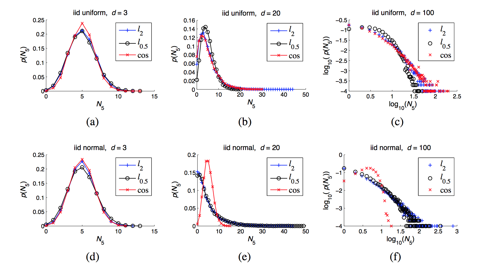

# 相关文章翻译

> a thorough discussion of the necessary conditions for hubness to occur in high dimensions will be given in Section 5.2.

> 维数灾难（Curse of Dimensionality），这一术语最初是由 Bellman 在1961年考虑优化问题时引入的，如今主要是指由数据空间中的高维数据向诸多领域所引发的挑战。在机器学习领域，受影响的方法和任务包括贝叶斯建模（Bishop，2006）、最近邻预测（Hastie et al。，2009）及搜索（Korn et al。，2001） 等。维数灾难造成的影响之一是距离集中（Distance Concentration），这是说在高维数据中的点对之间的距离渐渐趋向于相同。Hinneburg 和 Aggarwal 等人已经对高维数据中的距离集中和无意义的最近邻作了深入的研究。维数灾难造成的另一方面影响是 hubness。令 $D \subset R^d$，$D$ 为 $R^d$ 空间中的数据集，$N_k(x)$ 是数据集 $D$ 中的点 $x$ 的 $k-occurrences$ 值，$k-occurrences$  是指点 $x$ 出现在其它点的 $k$ 近邻列表中的次数。随着数据集维数的增加，$N_k$ 的分布开始逐渐向右倾斜，这导致了 $hubs$ 的出现， $hubs$ 是指那些极易出现在其它点的 $k$ 近邻列表中的点。不同于距离集中，hubness 及其影响在机器学习中并未引起太多的关注。~~The effect of the phenomenon on machine learning was demon- strated, for example, in studies of the behavior of kernels in the context of support vector machines, lazy learning, and radial basis function networks (Evangelista et al., 2006; Franc ̧ois, 2007).（例如，在支持向量机，惰性学习和径向基函数网络（Evangelista et al。，2006; François，2007）上下文中内核行为的研究中证明了这种现象对机器学习的影响。 ）~~

# Hubness 现象

令 $D ⊂ R^d，d\in\{1,2,…\}$ 表示一组数据点，其中 $x_1,x_2,…x_n$ 为数据集 $D$ 的元素。令 $dist$ 表示在 $R^d$ 空间中的一个距离函数 $p_{i,k}$，其中 $i, k \in \{1,2,…,n\}$ 如下定义：

​						$$p_{i,k}=\begin{cases} 1, & \text{if $x$ is among k nearest neighbours of $x_i$, according to $dist$} \\0  & \text{otherwise} \end{cases}$$

​	在此基础之上，定义 $N_k(x)=\sum_{i=1}^np_{i,k}(x)$，$N_k(x)$ 表示为在 $R^d$ 空间中，$x$ 出现在其它 k-nearest neighbor 列表中的次数，也记为 K-occurrence，仅根据数据点的 K-occurrence 的大小无法确定 hubness 对实验结果有何种影响。 数据点的 bad k-occurrences 表示为 $B_{N_K (x)}$，是指数据点 x 作为数据集 D 中其它的点的 k-nearest neighbor次数，并且 x 点的标签和那些点的标签不匹配。数据点的 good k-occurrences 表示为 $G_{N_K(x)}$， 是指点 x 的标签与那些点的标签相匹配[5]。为了表征 $N_k$ 的非对称性，我们使用 k-occurrences 分布的标准第三矩（也称作偏度）[b1]，

​									$$S_{N_k}=\frac{E(N_k-\mu_{N_k})^3}{\sigma_{N_k}^3}$$

其中 $\mu_{N_k}$ 和 $\sigma_{N_k}$ 分别是 $N_k$ 的均值和标准差。偏度是用于衡量实数域中随机变量分布的不对称性。偏度的值有正负之分，偏度为负则表明绝大多数的值（包括中值在内）位于平均值的右侧；偏度为正则表明绝大多数的值（不一定包括中值）位于平均值的左侧；偏度为零则表明数值近似地均匀分布在均值的两侧，却不一定为对称分布。

​	斯皮尔曼等级相关系数（Spearman correlation），用于评估两个变量相关性的非参数指标，记作 $\rho$。对于样本数为 $n$ 的数据集 $\mathbf X, \mathbf Y$，$x_i, y_i$ 为其对应的等级数据，相关系数$\rho$ 为：

$$\rho = \frac{\sum_i(x_i - \bar{x})(y_i - \bar{y})}{\sqrt{\sum_i(x_i-\bar{x})^2\sum_i(y_i-\bar{y})^2}}$$

​	在现实应用中，变量之间的连接并没有显著作用，因此可以对 $\rho$ 进行如下简化：

​		$$\rho = 1 - \frac{6 \sum d_i^2}{n(n^2 -1)}$$

其中，$d_i$ 表示被评估的两个变量等级之间的差值，$n$ 为样本数。斯皮尔曼相关系数阐述了 **X** (独立变量) 与 **Y** (依赖变量)的相关性。 若变量 **X** 增加时， 变量 **Y** 也增加，那么斯皮尔曼相关系数的值为正数；若变量 **X** 增加时，变量 **Y** 却在减少，那么斯皮尔曼相关系数的值为负数；若变量 **X** 和变量 **Y** 没有相关性，那么斯皮尔曼相关系数则为零。

# Hubs 的位置

​	以样本数据分布的均值作为参考点，可以看到 *k-occurrences* 的值与样本的位置的关系。 在高维空间中，当潜在的数据分布是单峰时，hubs 会接近样本的均值；当潜在的数据分布为多峰时（若干个单峰分布混合而成），hubs 趋向于接近最近的单峰分布的均值。

​	Hubness 现象常常与距离集中现象关联在一起。距离集中现象是指数据集中所有点到某一参考点的距离分布的标准差与均值的比值随着数据集维数不断增加而趋向于 0 的现象。

> Based on existing the- oretical results discussing distance concentration (Beyer et al., 1999; Aggarwal et al., 2001), high- dimensional points are approximately lying on a hypersphere centered at the data-set mean. 

​	基于现有的距离集中理论表明（Beyer et al。，1999; Aggarwal et al。，2001），高维数据分布于以样本均值为中心的的超球面上。

> 由卡方分布延伸出来皮尔森卡方检定常用于： (1)样本某性质的比例分布与总体理论分布的拟合优度；(2)同一总体的两个随机变量是否独立；(3)二或多个总体同一属性的同素性检定。[b2] 补充

节点中心性这一术语通常应用在网络分析领域[d3]，在聚类分析中，点的空间中心性与*k-occurrences* 有关，随着维度的增加，越接近空间中的其它点。

真实数据集与人工数据集有两处不同；（1）真是数据集通常包含相关属性；（2）真是数据集通常是由多个簇组成的。为了检验第一个属性（相关属性），采用了Franc ̧ois的方法[b4]。

> 对每一个数据集，打乱它的每一维的顺序 （确认一下）这样就可以消除它们之间的相关性，数据集的本征维数将会逼近它的嵌入维数（embedding dimensionality）。

在真实数据集中，hubs 相比其它点更易接近它们各自所在的簇中心。

$N_k$ 的偏度与本征维数强烈相关，在本征维数越高的数据空间，hubs 会越接近簇中心。

> First, let us consider the geometric upper limit to the number of points that point x can be a nearest neighbor of, in Euclidean space. In one dimension, this number is 2, in two dimensions it is 5, while in 3 dimensions it equals 11 (Tversky and Hutchinson, 1986). Generally, for Euclidean space of dimensionality d this number is equal to the kissing number, which is the maximal number of hyperspheres that can be placed to touch a given hypersphere without overlapping, with all hyperspheres being of the same size.14 Exact kissing numbers for arbitrary d are generally not known, however there exist bounds which imply that they progress exponentially with d (Odlyzko and Sloane, 1979; Zeger and Gersho, 1994). Furthermore, when considering k nearest neighbors for k > 1, the bounds become even larger. Therefore, only for very low values of d geometrical constraints of vector space prevent hubness. On the other hand, for higher values of d hubness may or may not occur, and the geometric bounds, besides providing “room” for hubness (even for values of k as low as 1) do not contribute much in fully characterizing the hubness phenomenon. Therefore, in high dimensions the behavior of data distributions needed to be studied.

> if the number of dimensions is large relative to the number of points, one may expect to have a large proportion of points with N1 equaling 0, and a small proportion of points with high N1 values, that is, hubs.16 Trivially, Equation 23 also holds for Nk with k > 1, since for any point x, Nk(x) ≥ N1(x).

​	本章我们将会讨论在考虑降维技术的情况下，$N_k$ 的偏度与本征维数的相互关系。此研究的目的主要在于探究降维技术是否能够缓解 $N_k$ 的偏度这一问题。本文采用了主成分分析的降维技术（PCA）。在多变量的统计分析中，主成分分析（Principal components analysis，PCA）常常用于分析和简化数据集。主成分分析通过保留对方差贡献最大的样本特征，从而降低数据集的维数。Pearson 于1901 年发明了主成分分析[b5]，常常用于数据分析以及模型建立。主成分分析的主要思想是将协方差矩阵进行特征分解，从而获得数据的主要成分（特征向量）及其对应的权重（特征值）。

## PCA理论基础

​	本节将会在探讨协方差矩阵的特征向量是 *k* 维理想特征的理论知识：最大方差理论、最小误差理论以及坐标轴相关度理论。

### 最大方差矩阵理论

​	在数字信号处理中，具有较大方差的是信号，反之则是噪声，那么，信噪比就可以被描述为是信号与噪声的方差的比值。因此，理想的 *k* 维特征就是将原始的 *n* 维数据集变换为 *k* 特征后，每一个维度上均具有较大的样本方差。

### 最小平方误差理论

​	令 $D \subset R^d, d \in \{1,2,3,…\}$，数据集 *D* 包含 *n* 个样本点（$x_1, x_2,…,x_n$），样本在分割面上的投影记为 $x_k'$，那么最小平方误差的公式如下：

​						$$\sum_{k=1}^d||(x_k'-x_k)||^2$$

PCA算法步骤：

（1） 使用 *n* 行 *d* 列的矩阵 *X* 表示原始数据；

（2）将矩阵 *X* 的每一列进行零均值化，即减去这一行的均值；

（3）求解协方差矩阵，$C=\frac{1}{n}X^TX$；

（4）求解协方差矩阵的特征值及其特征向量；

（5）令特征向量按照其对应的特征值降序排序，取前 *k* 列组成新的矩阵 *P*；

（6）Y = PX 即为降维后新的数据。

# 聚类

​	基于距离的聚类算法的主要目标是最小化同一个簇内对象之间的距离同时最大化簇间对象之间的距离。在高维数据空间中，*k-occurrences* 的偏度将会对上述两个对象造成影响。具有低 *k-occurrences* 的点很可能会增加簇内对象之间的距离，这些点远离数据集的其它点，可以将其视为离群点。目前，关于离群点在聚类分析方面的应用已经作了诸多的研究，

​				
​			
​		
​	

​	

[b1] Groeneveld, RA; Meeden, G. Measuring Skewness and Kurtosis. The Statistician. 1984, 33 (4): 391–399. 

[b2] Pearson, Karl. On the criterion that a given system of deviations from the probable in the case of a correlated system of variables is such that it can be reasonably supposed to have arisen from random sampling (PDF). Philosophical Magazine Series 5. 1900, 50 (302): 157–175. 

[b3] John P. Scott. Social Network Analysis: A Handbook. Sage Publications, 2nd edition, 2000.

[b4] Damien Franc ̧ois. High-dimensional Data Analysis: Optimal Metrics and Feature Selection. PhD thesis, Universite ́ catholique de Louvain, Louvain, Belgium, 2007.

[b5] Pearson, K. On Lines and Planes of Closest Fit to Systems of Points in Space (PDF). Philosophical Magazine. 1901, 2 (6): 559–572.

